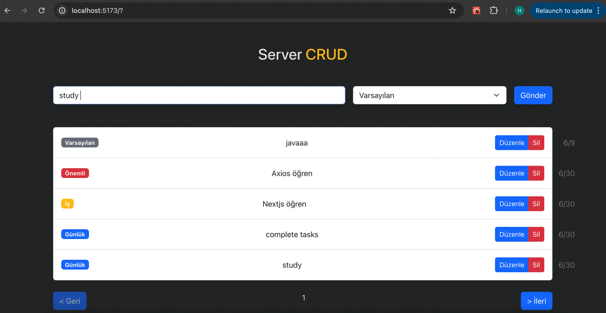

<h1> Vite-Axios-Json Server CRUD Project </h1>

<h2> Screen gif CRUD Project </h2>

# Vite Proje için Adımlar

- Vite bir tool - hazır bir şekilde react uygulaması getiriyor.

- `npm create vite klasör_ismi` > ye belirttiğimiz klasörü oluşturup içerisine react projesi oluşturur.

- `npm create vite .` > sona nokta koyarsak bulunduğumuz klasörün içerisine react projesi oluşturuyor.

- `npm install` > diyerek node modules indirme yapıyoruz.

-`npm run dev` > projeyi ayağa kaldırmak için

# Vite Artıları

- Proje oluşturma/ proje ayağa kaldırma gibi işlemleri vite ile çok daha hızlı gerçekleştirebiliyoruz.

- Gereksiz kodlardan/dosyalardan arındırılmış bir react projesi oluşturur.

- Build işlemi çok daha hızlı.

# Değişenler (yani vite olmadan oluşturduğumuz react projesinden farklı olarak)

- App.js ve index.js'in yerini App.jsx ve main.jsx aldı.

- Projeyi ayağa kaldırırken `npm start` yerine `npm run dev`yazıcaz.

# JSON-SERVER

- Sadece kendi bilgisayarımızda çalışan API'lar oluşturmamıza yarayan bir kütüphane. Yani fake API'lar. Başkası istek atamaz.

- Kendimizi geliştirmek için yazdığımız basit uygulamaların backend ihtiyacını karşılar.

- Hızlı Prototipleme: Örneğin bir araç kiralam sitesi oluşturacaksın ama backend'ci sana hemen oluşturamıyor, 2 ay var diyor örneğin ama sen de o sırada projeyi belli bir aşamaya getirmek zorundasın. O zamanı verimli kulllanmak adına json-server'ı kullanarak en azından bir prototipleme yani uygulamanın nasıl gözükeceğine dair bir fikir sahibi oluyorsun bu prototiplemeyle. Yani Backend developerın api'ı oluşturduğu süreçte uygulamanın temel özelliklerini geliştirebilmek adına geçici bir süre kullanılabilir.
  En karmaşık uygulamayı da yapsan en basitini de yapsan, frontend'çinin görevi API'den verileri alıp o verileri işleyip kullanıcıya sunmaktır. Instagram, twitter, youtube, her ne uygulama yaparsan yap görevin bu. Api'leri oluşturmak backend'çinin görevi.

- Json-server ile oluşturduğumuz api'ye bütün http metodları istek atabiliriz.

- Yaptığımız istek sonunda eğer verilerde bir değişim olursa anlık olarak db.json'da güncellenir.

# Kurulum

- npm i json-server 'la birlikte paketi indiririz (i install oluyor)

- db.json dosyası oluştur ve düzenle

- package.json'a server'ı ayağa kaldırma komutu yaz.

- komutu çalıştır.

# CRUD (Create Read Update Delete)

- Oluşturma, Okuma, Düzenleme, Silme İşlemleri

# Axios

- HTTP istekleri için modern çözüm
- fetch'den farkı, fetch'i herhangi bir paket indirmeden kullanabiliyorken, axios'u kullanacaksak bunun npm paketini indirmemiz gerekiyor. Yani yerleşik değil, paketi indirmek gerekli
- npm i axios
- Hangi sebeplerden dolayı fetch'in yerine tercih ediyoruz?

1. İsteklerde fetch'e göre daha az kod yazarız
2. Hataları daha detaylı bir şekilde gösterir
3. Alınan veri için .json() metodu ile yaptığımız formatlama işlemini otomatik olarak yürütür
4. Veri gönderirken otomatik olarak stringify yapar ve veriyi otomatik olarak body kısmına ekler.

## GET Karşılaştırma

### Fetch

`fetch("http://localhost:3001/todos")
      .then((res) => res.json())
      .then((data) => setTodos(data));`

### Axios

`axios
    .get("http://localhost:3001/todos");
    .then((res) => setTodos(res.data));`

## POST Karşılaştırma

### Fetch

`fetch("http://localhost:3001/todos", {
      method: "POST",
      body: JSON.stringify(newTodo),
    })`

### Axios

` axios
      .post("http://localhost:3001/todos", newTodo)`

## Delete Karşılaştırma

### Fetch

`fetch("http://localhost:3001/todos/4", {
      method: "DELETE"
})`

### Axios
